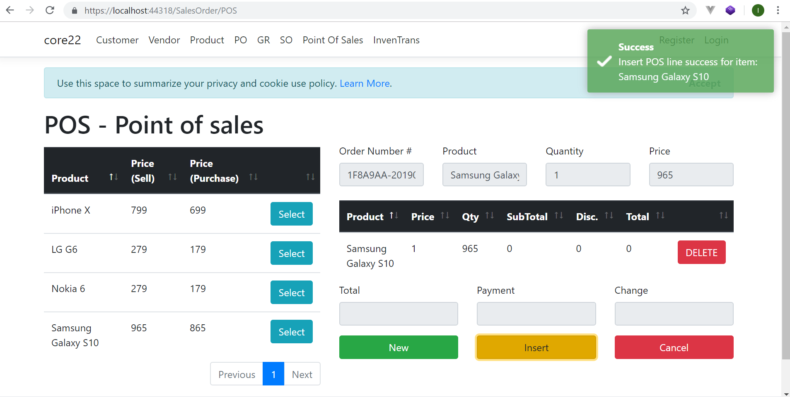
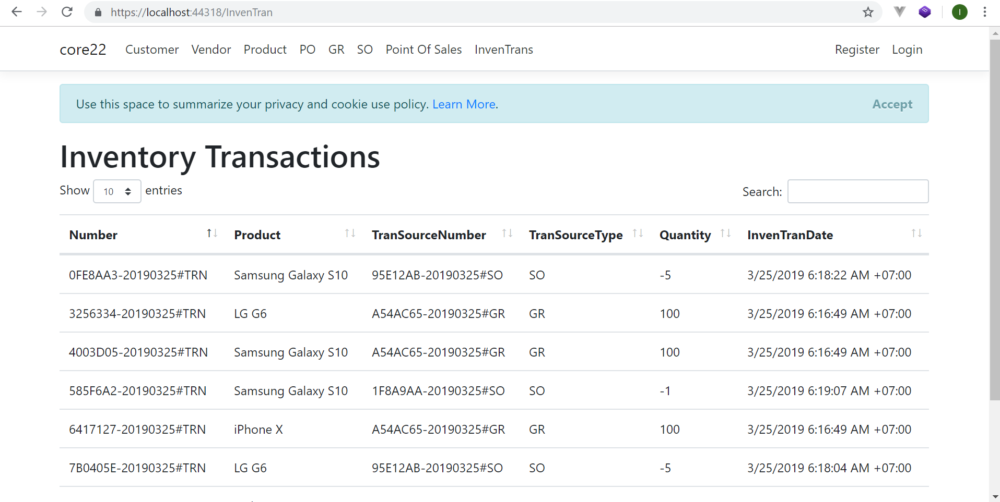
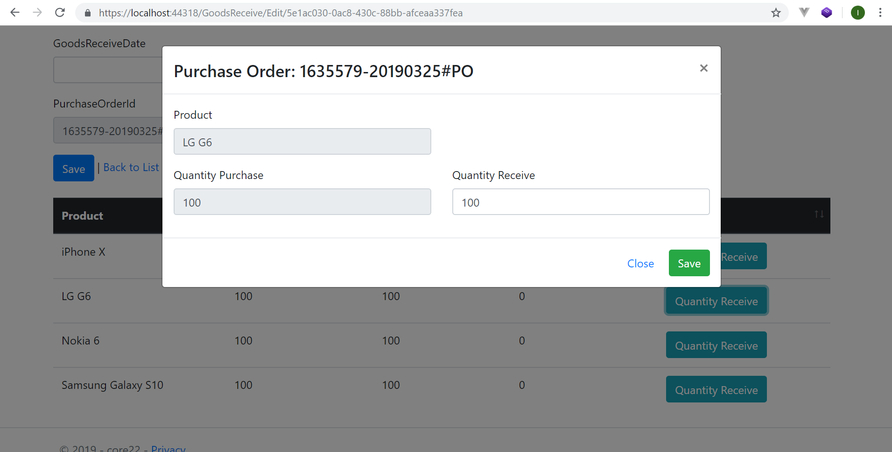
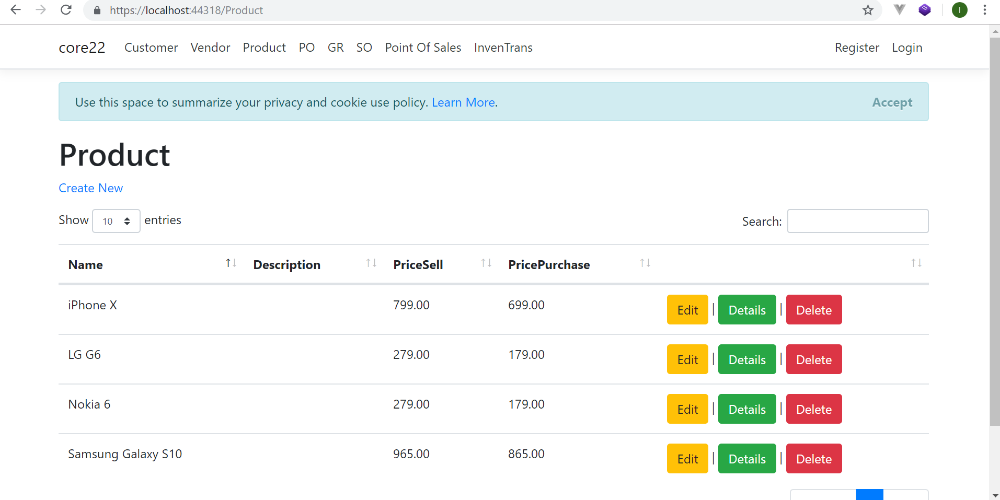

# POS - Point of sales

Proof of concept of point of sales developed using Asp.Net core 2.2.

Features:

1. customer management
2. vendor management
3. product management
4. purchase order management
5. goods receive management
6. sales order management
7. inventory transactions
8. POS form / screen

Technical:

1. C#
2. EF (Entity Framework)
3. jQuery
4. Bootstrap
5. Datatables.net
6. axios
7. web api
8. toastr

# Development Tools & Environment

I'm using **Visual Studio Community 2017** for the development tools on Windows 10 machine.

# .Net Core Version

I'm using **.Net Core 2.2**

# Supported by CodeRush.Co
[CodeRush.CO] source code collections (https://coderush.co) lot of open source cool apps there. 50% Off All Products, Use Discount Code **GITHUB50**

